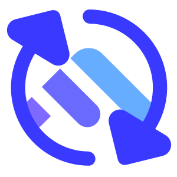

#  OnTrack Reloaded

Custom client to view data from Deakin University's OnTrack assessment system, used for IT and CS units.

I'm building this as a learning exercise and to find ways to view and track my course progress and upcoming assessment information that work better for me than the current OnTrack interface. 

A bit about how it's built and how it works: 
- [Wording and Definitions](server/README.md#wording-and-definitions)
- [GraphQL Server](server/README.md)
  - [Datasources](server/README.md#datasources-server-level)
  - [Resolvers](server/README.md#resolvers-server-level)
  - [Schemas and types](server/README.md#schemas-server-level-and-types)
  - [Front-end queries](server/README.md#queries-front-end)
  - [A complete example](server/README.md#a-complete-example)
- [Front-end app](frontend/README.md)

Other important information:
- [Making your own version](#making-your-own-version)
- [Warranty (lack thereof)](#warranty-lack-thereof)

---
## How to use 

**Prerequisites:** Node, an IDE, and a web browser.

1. Fork this repo.
2. Clone your fork on your machine.
3. In a terminal, un `npm install` from the root of the project (it uses [NPM workspaces](https://docs.npmjs.com/cli/v7/using-npm/workspaces))
4. In the terminal, go into the server folder with `cd server` and run `npm run dev`
    - Optionally, go to http://localhost:5000 in your browser to use [GraphQL Playground](https://www.apollographql.com/docs/apollo-server/v2/testing/graphql-playground/)
5. In a second terminal window, go into the frontend folder with `cd frontend` and run `npm run dev`
   - Open the URL shown in your terminal.

### Getting your OnTrack auth token

You can find the auth token by logging into OnTrack with your browser dev tools open and either:
- going to the Network tab and inspecting the request headers for any of the API calls, or
- going to the Storage tab and finding the token in the `doubtfire_user` object.

Or, you can semi-automate this process using a browser extension such as [GreaseMonkey](https://addons.mozilla.org/en-US/firefox/addon/greasemonkey/) or [TamperMonkey](https://chrome.google.com/webstore/detail/tampermonkey/dhdgffkkebhmkfjojejmpbldmpobfkfo) to run a custom script to automatically copy it to the clipboard when you load or refresh OnTrack. Here's the one I use with GreaseMonkey:

```js
const data = window.localStorage.getItem('doubtfire_user'); 
const token = JSON.parse(data).authenticationToken;
navigator.clipboard.writeText(token);
alert("Copied auth token: " + token);
```

### Making your own version

You are welcome to fork this repo and modify it to find your own way of managing your OnTrack units, and I would love to see what you come up with! Alternatively if you pretty much use my app as-is but have any suggestions or fixes/tweaks, pull requests are also welcome.

:warning: If you would like to use this repo as a starting point for your own app, I would really appreciate it if you definitely actually _fork_ it (don't download and copy) on GitHub. This is so it will show up in the list of forks and I (and others) can learn from your work as well, and can form part of giving me due credit by making what you used from my project clear in the commit history.


---
## Warranty (lack thereof)

While I will respond to GitHub issues to the best of my ability when I have capacity to do so, please understand that this is a side project primarily built for personal use and published a) to showcase some of my skills and b) in the hope that it may assist fellow students. 

This project is published as-is, with absolutely no warranty whatsoever, no guarantee of support, no guarantees about its functionality or data completeness, and no guarantee that changes to this app will be backwards-compatible (i.e., no promise that forks won't break if my changes are pulled into them).

This project does noes not replicate all functionality of OnTrack. I accept no responsibility for missed tasks or assessment information if you use this app. It is your responsibility to check the official OnTrack app regularly to make sure you have the latest and complete information.

With that fine print out of the way, go forth and reload! 
